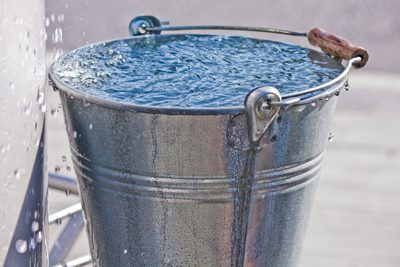
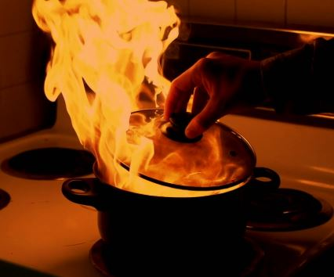

# History & Stories

## History

The Halloweenie Roast has been going on since around 1988.  Dave and Gina always threw it as their one big party every year.  It's been a Haines family staple ever since.  Now since they've moved and downsized, it's up to me to take it over.  This 2019 will be the first annual Weenie Roast at my new house.  You can see the location details [here](location.md).

## Stories

### Ice Bucket

I remember one weenie roast back when we still lived on 250 S and I was probably 7 years old.  It was probably the coldest weenie roast we've ever had.  It was pretty much a bilzzard.  It was snowing,
blowing, and sub zero.  Only the few die-hard people who came every year happened to show up.  People were in full snow pants and parkas.  We had a blazing fire which only helped to make things slightly more bearable.  We even put up plastic to block the wind blowing in off the corn fields.  We always kept a bucket of water near the fire in case someone got burned.  This year the bucket had turned into ice cold water with a thick layer of ice on top.  Someone put it by the fire to try and keep it thawed.  As I was going to get a bowl of chili I stepped back and stepped completely into the bucket.  My foot crashed through the ice, and I went flying.  The water soaked my leg and boot right away, and then ran over the ground soaking me while I was on the ground.  It was awful.  I had to go inside and Mom helped me put new clothes and pants on so I could continue outside at the party.

### Grease Fire

I have an aunt who is rather large.  She also happened to be a bit of a fire bug.  She was always the one who wanted to stack the fire, help it get bigger, reorganize the wood, etc.  She was the first to jump up and add logs even when they weren't needed.  One weenie roast, around 1995 maybe, it was late and the party was dying down.  Many hot dogs, marshmallows, and bowls of chili had been consumed.  Everyone was in the post-dinner lull lounging on hay bales and staring into the fire.  My large fire-bug aunt was leaning into the fire and slowly stirring it with a stick.  Someone outside the ring of darkness said "Be careful you don't fall into the fire."  My Uncle (her husband) was dreamily staring into the coals and softly said aloud "That would be one hell of a grease fire."  Everyone slowly turned to look at him.  He looked up from the fire and glanced around...the awareness slowly coming to him that he had said it aloud instead of in his head.  The entire circle of people erupted in laughter and my poor Aunt turned a color of read you could see even in the late night glow of the fire.

Every year since there have been multiple comments throughout the night about grease fires.
